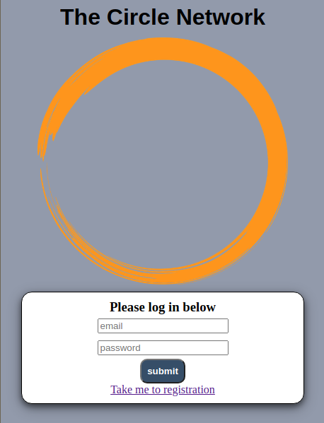

# Social Network

## Installation

After cloning this repo to your desired location, install the 
dependancies with npm. This project was created with Node version 
10.15.1

```sh
$ npm intall

```
Create a `secretes.json` to the path `./config/secrets.json`. This file is
included in the `.gitignore`.

In this file add the information as follows: 

```json

{
  "cookieSecret": "your cookie secret",
  "awsKey" : "your aws key",
  "awsSecret": "your aws secret",
}
```
In development to start the server you you need two shells. In the first shell run:


```sh
$ node bundle-server.js

```
And in the second, your Express server with:

```sh
$ node index.js 

```
Extra configuration is needed. First, an Amazon Web Services account, and a PostgresSQL server. The 
models for the tables can be found in `./models/sql/`

### Example of the login page.


